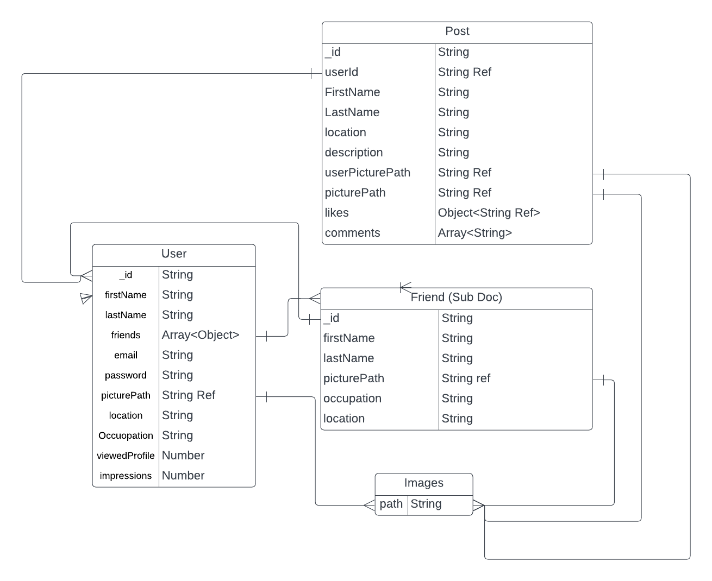
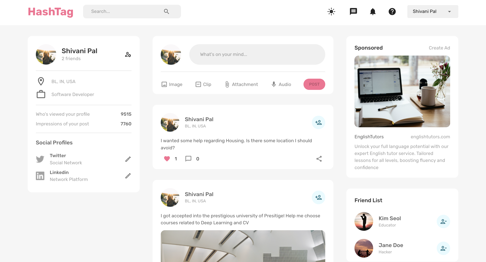
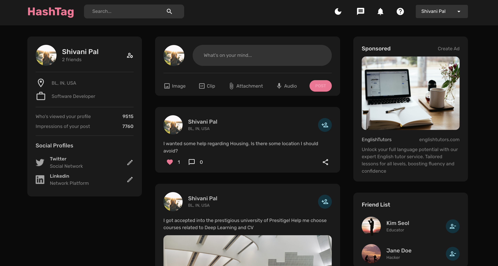
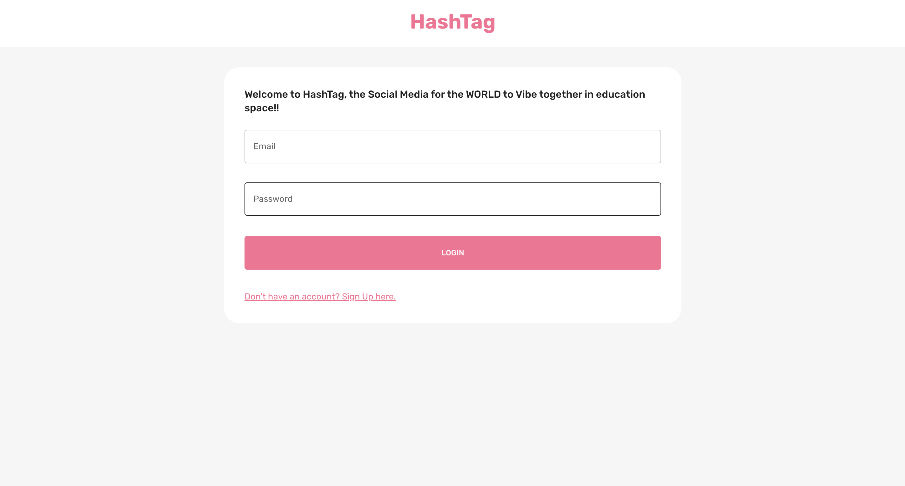
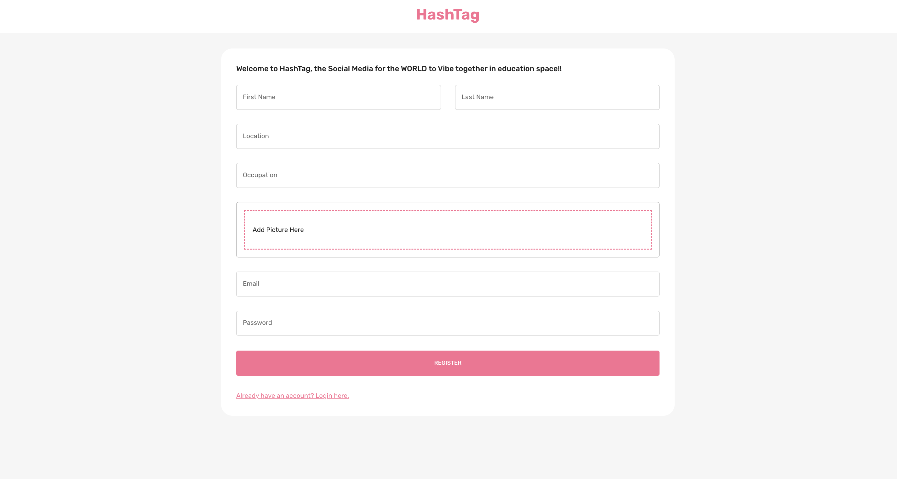

# HashTag - The University Social Networking App

Welcome to HashTag, a social networking application designed exclusively for university students. HashTag offers a unique platform for connecting, sharing, and accessing essential resources relevant to university life.

## Uses

- **Resources:** Student can access comprehensive resources covering visa and immigration, housing options, local culture, and academic insights.
- **User Profiles:** Create personal profiles, share photos, and document your academic journey.
- **Connecting Peers:** Facilitate connections between incoming and current students, fostering interaction and support.
- **Engaging Discussions:** Participate in lively discussion threads, ask questions, and engage in conversations.
- **Event Updates:** Stay updated on upcoming university events, club meetups, and local activities.
- **On-Campus Job Search:** Explore opportunities for on-campus jobs to earn while you learn.
- **Technology Stack:** Developed using React for the frontend and Node.js Express with MongoDB for the backend.

## Technology Stack

### Main Technologies

- **React**: A JavaScript library for building user interfaces.
- **Express**: A fast and minimalistic web framework for Node.js.
- **MongoDB**: A NoSQL database for storing and managing data.

### Client Side

- **@mui/material**: A popular UI framework for building modern web applications.
- **@reduxjs/toolkit**: A set of tools for managing state in React applications.
- **formik**: A library for handling forms with React.
- **react-dropzone**: An easy-to-use component for file uploads.
- **react-redux**: A library for managing global state in React applications.
- **react-router-dom**: A routing library for React applications.
- **yup**: A schema validation library for handling form validation.
- **dotenv**: A zero-dependency module for loading environment variables.
- **@emotion/react**: A library for writing CSS styles with JavaScript.
- **@emotion/styled**: A styling solution for creating styled components.
- **@mui/icons-material**: Icons library for MUI components.
- **@testing-library/react**: A testing utility for React components.
- **web-vitals**: A tool for measuring performance metrics in web applications.

### Server Side

- **bcrypt**: A library for hashing and salting passwords.
- **cors**: A middleware for enabling CORS in Express applications.
- **jsonwebtoken**: A library for creating and verifying JSON Web Tokens.
- **mongoose**: An Object Data Modeling (ODM) library for MongoDB.
- **gridfs-stream**: A library for working with GridFS, a file storage solution for MongoDB.
- **helmet**: A middleware for adding security headers to Express applications.
- **body-parser**: A middleware for parsing request bodies in Express applications.
- **morgan**: A middleware for logging HTTP requests in Express applications.
- **multer**: A middleware for handling file uploads in Express applications.
- **multer-gridfs-storage**: A storage engine for GridFS file uploads.

## Installation

1. Clone this repository.
2. Navigate to the frontend directory: `cd client`.
3. Install frontend dependencies: `npm install`.
4. Run the frontend development server: `npm start`.
5. Navigate to the backend directory: `cd server`.
6. Install backend dependencies: `npm install`.
7. Run the backend server: `npm start`.

## Modelling

## UI

### Home Page

### Home Page - dark Mode

### Login Page 

### Register Page

### User Profile 

## Ongoing Improvements

HashTag is currently in a rudimentary phase as I lay the groundwork for exciting future features and enhancements. My goal is to evolve and expand the app to provide an even more enriching experience for university students.

## License

This project is licensed under the MIT License.

**Discover, Connect, Thrive with HashTag!!**
